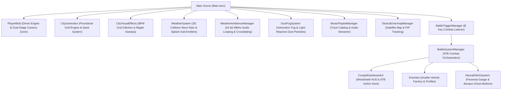

# Coding Structure Plan & Project Architecture Rules

## Core Principles

1. **Strict Modularization & Single-File Focus**
   - Every feature, effect, atmosphere system, and mechanic exists in its own dedicated, isolated script file.
   - Zero "god scripts" or monolith files.
   - Core city generator and driving engine remain untouched and decoupled from visual effects, weather, or combat logic.

2. **Descriptive & Non-Generic Naming Conventions**
   - Variable, constant, and mesh names must be highly expressive, domain-specific, and self-documenting to avoid scope collisions and confusion.
   - Strictly avoid generic names (`data`, `temp`, `manager`, `obj`, `quad_mesh`, `streak_mat`).
   - Use clear, thematic terms (`cockpit_hud_overlay`, `cyber_rain_streak_quad_mesh`, `neural_glitch_potency`, `tactile_dashboard_button`, `cyber_war_rig`).

3. **Explicit & Obvious Numbers**
   - Keep key tweaking numbers exposed via `@export` variables at the top of scripts.
   - Document vectors, RGB colors, array indices, and transform parameters with explicit inline comments explaining what each number does.

4. **Preserve User Settings & State Safety**
   - Whenever changing camera viewing angles or zoom levels on behalf of the player (e.g., satellite map screen), save the original camera FOV, offset, and pitch settings and restore them perfectly upon exit.

5. **Separate Narrative & Dialogue Files**
   - All story lore, mission briefings, character dialogue logs, and cutscene text **MUST** exist in their own separate, dedicated files (`.txt`, `.json`, or `.md`) in a dedicated directory/structure.
   - Never hardcode long story narratives or dialogue scripts directly inside GDScript game logic. Game scripts only load and parse external story files.

---

## Project System Architecture

---

## Complete Module Breakdown

| Module Script | Responsibilities |
| :--- | :--- |
| **`PlayerBlob.gd`** | Handles car driving physics, friction, steering, mouse wheel FOV zooming (`35°` to `150°`), and dual-stage camera pitch interpolation (stage 1 driving focus, stage 2 ultra-zoom skyward tilt). |
| **`CityGenerator.gd`** | Procedurally builds grid asphalt, building collision blocks, window illumination textures, rooftop neon border lines, and supports `city_seed` for persistent map seeds. |
| **`CityVisualEffects.gd`** | Controls BPM-synced color spectrum shifts, power supply hiccups/blackout flickers, and corner-to-corner wave ripple pulse sweeps (scaled at 50% strength). |
| **`WeatherSystem.gd`** | Controls ambient neon rain streaks with chaotic wind angles, 3D physics building roof collision sensing, and sub-emitter rain splash particle bursts on ground/roof impact. |
| **`WeatherAmbienceManager.gd`** | Manages looping 24-bit 48kHz WAV audio playback and smooth 2.5s crossfading transitions between rain downpours and textural wind breezes during weather shifts. |
| **`DustFogSystem.gd`** | Manages volumetric cyber fog and 1800 floating dust specks with lit billboard shading so dust specks dynamically pick up and reflect nearby skyscraper neon lights. |
| **`MusicPlaylistManager.gd`** | Manages track catalogs across `DRIVING`, `BATTLE`, and `STORY` playlists, provides live BPM metadata, and handles automatic combat music switching. |
| **`TacticalOvermapManager.gd`** | Listens for `M` key press, switches to satellite overhead view, renders a top-right PIP close-up live feed window (`220x140px`) following the car, and restores exact player camera FOV/transforms on exit. |
| **`BattleTriggerManager.gd`** | Listens for the `B` key during city driving to initiate/exit combat encounters without altering driving physics. |
| **`BattleSystemManager.gd`** | Orchestrates the ATB combat loop, turn states, 3D hostile vehicle spawns ahead of car, and seamless camera transition to windshield view. |
| **`CockpitDashboardUI.gd`** | Renders first-person windshield frame, Orbitron synth-deck dashboard panel, active ATB progress bars, and action buttons. |
| **`Enemies.gd`** | Defines enemy profiles (Corporate Enforcers, Heavy War-Rigs, Hunter Drones), stats, weaknesses, and 3D hostile mesh generation. |
| **`NeuralGlitchSystem.gd`** | Tracks Mack's mental glitch gauge, passive decay, glitch intensity triggers, and Banquo ghost button spawns. |

